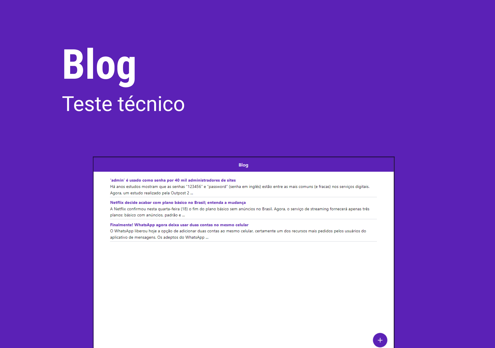

<h1 align="center">
  
</h1>

  

 

  

## ✨ Tecnologias

Esse projeto foi desenvolvido com as seguintes tecnologias:

- [React Js](https://pt-br.legacy.reactjs.org/)
- [Next.js](https://pt-br.legacy.reactjs.org/)
- [Typescript](https://www.typescriptlang.org/)
- [Tailwindcss](https://tailwindcss.com/)

## 💻 Projeto

O aplicativo desenvolvido para realizar visualização, cadastro, edição e exclução de posts da página, sendo os seguintes campos (title, content).
Todos os dados salvos no aplicativo mantidos pela api fornecida.

## 🚀 Como executar

- Clone o repositório
- Instale as dependências com `npm install`
- inclua o arquivo '.env.local' com o arquivo de '.env.example' preenchendo os dados 
- Inicie a aplicação com `npm run dev` para rodar em modo de desenvolvimento

Abra http://localhost:3000 com seu navegador para ver o resultado.

## Build

- Realize as configurado do '.env.local' e instalação de dependências
- Rode o comando `npm run build`
- Para executar use `npm run start`

Abra http://localhost:3000 com seu navegador para ver o resultado.

## 📄 Licença

Esse projeto está sob a licença MIT. Veja o arquivo [LICENSE](LICENSE.md) para mais detalhes.

